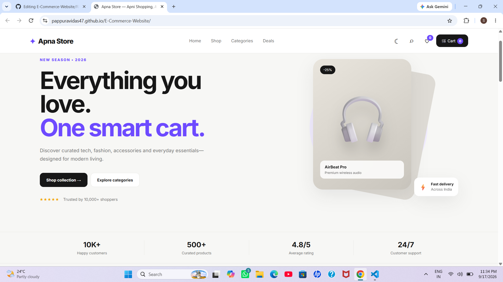

# E-Commerce Website

A modern and responsive e-commerce website frontend built using **HTML, CSS, and JavaScript**. This project provides a smooth shopping experience with product browsing, search, filtering, wishlist, cart management, product quick view, and dark mode.

## 🚀 Live Demo

https://pappuravidas47.github.io/E-Commerce-Website/

## 📸 Preview



## ✨ Features

* 🏠 Modern homepage
* 🛍️ Product catalogue
* 🔍 Product search
* 🏷️ Category filtering
* ↕️ Product sorting
* ❤️ Wishlist functionality
* 🛒 Add to cart
* ➕➖ Cart quantity controls
* 🗑️ Remove products from cart
* 💰 Automatic cart total calculation
* 💾 LocalStorage support
* 🌙 Dark mode
* 👀 Product quick view
* 🔥 Deals and offers section
* 📧 Newsletter section
* 🔔 Toast notifications
* 📱 Fully responsive design
* ⚡ Smooth and interactive UI

## 🛠️ Tech Stack

* HTML5
* CSS3
* JavaScript
* LocalStorage
* Google Fonts

## 📂 Project Structure

```text
E-Commerce-Website/
│
├── index.html
│
├── css/
│   └── style.css
│
├── js/
│   └── app.js
│
├── preview.png
│
└── README.md
```

## ▶️ Run Locally

1. Download the project.

2. Extract the ZIP file.

3. Open the **E-Commerce-Website** folder in VS Code.

4. Open `index.html`.

5. Right-click on `index.html`.

6. Select **Open with Live Server**.

7. The website will open in your browser.

## 🔍 Main Functionality

### Search

Search products using the search bar.

### Category Filter

Filter products according to different categories.

### Sorting

Products can be sorted by:

* Featured
* Price: Low to High
* Price: High to Low
* Rating

### ❤️ Wishlist

Add or remove products from the wishlist. Wishlist data is stored using LocalStorage.

### 🛒 Shopping Cart

Users can:

* Add products
* Increase quantity
* Decrease quantity
* Remove products
* View cart items
* Calculate total price

Cart data is saved in **LocalStorage**.

### 🌙 Dark Mode

Switch between light and dark themes. The selected theme is saved using LocalStorage.

### 👀 Product Quick View

View product information quickly without leaving the current page.

## 📱 Responsive Design

The website is optimized for:

* 💻 Desktop
* 💻 Laptop
* 📱 Mobile
* 📟 Tablet

## 🔮 Future Improvements

* User authentication
* User registration and login
* User profile
* Product reviews and ratings
* Product details page
* Checkout system
* Online payment integration
* Order management
* Order history
* Admin dashboard
* Seller dashboard
* Backend API
* MongoDB database
* MERN Stack implementation

## ⚠️ Disclaimer

This project is created for **learning, practice, and portfolio purposes**.

It is currently a **frontend-only e-commerce website** and does not process real payments or real orders.

## 👨‍💻 Credits

Made with ❤️ by **Pappu Kumar Ravidas**

🎓 B.Tech CSE Student
💻 Future Software Developer | Frontend Enthusiast

## ⭐ Support

If you like this project, please consider giving it a ⭐ **star** on GitHub!

---

**© 2026 Pappu Kumar Ravidas**
